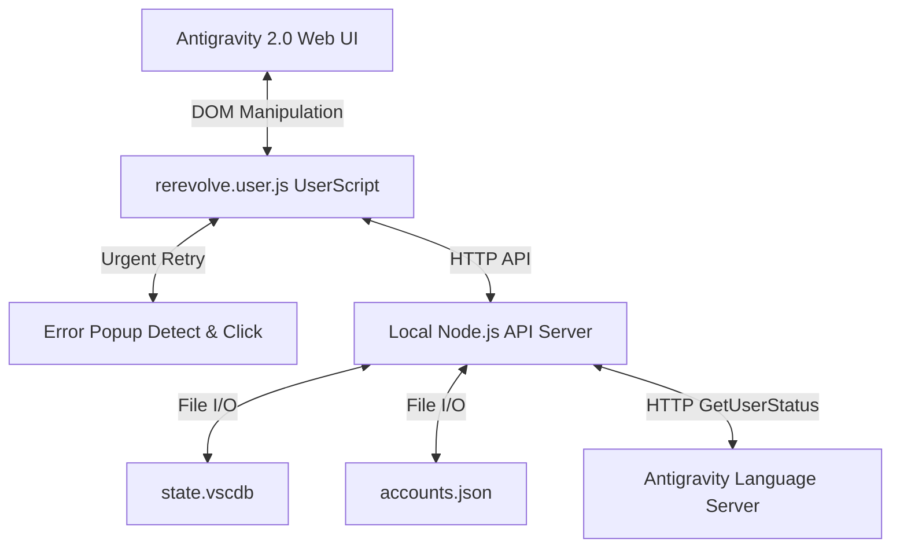

# ReRevolve 2.0 Design Specification: Antigravity 2.0 Integration & Urgent Error Retry

안티그래비티 2.0이 독립적인 웹 기반 UI(일렉트론 및 웹 브라우저)로 전환됨에 따라, 기존 VS Code 확장 프로그램 구조를 탈피하고 새로운 웹 환경에 완벽히 호환되도록 ReRevolve 2.0을 하이브리드 아키텍처로 재설계합니다.

특히, 서버 혼잡 등으로 발생하는 `"Agent terminated due to error"` 팝업의 **[Retry] 버튼 자동 클릭** 문제를 가장 최우선 긴급 과제로 반영하여 해결합니다.

---

## 📌 1. Urgent Requirement: Automated Error Retry

안티그래비티 에이전트 구동 중 서버 에러로 터질 때 나타나는 팝업 UI를 실시간 감지하여 `Retry` 버튼을 자동으로 즉시 클릭해 주는 무중단 복구 메커니즘을 설계합니다.

### 🔍 타겟 UI 분석 (DOM Selector)
* **팝업 식별 단서**:
  * 텍스트: `Agent terminated due to error` 또는 `You can prompt the model to try again`
  * 버튼: `Retry` 텍스트를 가진 `button` 태그
* **감지 매커니즘**:
  * 단순 폴링(`setInterval`) 대신 브라우저의 고성능 DOM 감시 API인 `MutationObserver`를 사용해 화면 변화를 10ms 단위로 즉시 추적합니다.
  * 새로운 노드가 추가될 때 내부 텍스트에 "Agent terminated due to error"가 포함되어 있거나, `Retry` 버튼이 활성화되면 즉시 `.click()` 이벤트를 발생시킵니다.
  * **연속 에러 방지(지연)**: 혹시 모를 무한 재시도 루프를 막기 위해, 클릭 후 2초간은 재시도를 디바운싱(Debounce)하는 안전장치를 내장합니다.

---

## 🏗️ 2. ReRevolve 2.0 하이브리드 아키텍처

로컬 PC 리소스 제어(샌드박스 우회)와 웹 UI 조작을 동시에 달성하기 위해 **"프론트엔드 유저스크립트"**와 **"백엔드 로컬 데몬"**을 연동합니다.

### 🖥️ A. 프론트엔드: `rerevolve.user.js` (Tampermonkey UserScript)
1. **아이콘 주입**:
   * 좌측 상단 헤더 영역(화살표 및 세션 제어 버튼 근처)의 DOM 구조를 해석하여 ReRevolve 전용 전환 단추(🔄)를 주입합니다.
2. **화면 토글**:
   * 토글 클릭 시, 현재 안티그래비티의 메인 대화창 컨테이너의 CSS 스타일을 `display: none`으로 숨깁니다.
   * 동일한 레이아웃 영역에 프리미엄 디자인(CSS Grid/Flexbox)이 적용된 ReRevolve 멀티 계정 쿼터 현황판 UI를 동적으로 생성 및 삽입합니다.
   * 재클릭 시, 삽입된 UI를 제거하고 기존 채팅 컨테이너의 스타일을 원복(`display: flex` 등)합니다.
3. **실시간 데이터 동기화**:
   * 로컬 데몬 서버(`http://localhost:8320`)로 주기적인 Ajax 요청을 보내 현재 쿼터 정보와 활성 계정을 확인 및 갱신합니다.

### 💾 B. 백엔드: `server.js` (Local Node.js Daemon Server)
1. **포트 실행**:
   * 로컬 PC에서 백그라운드로 `localhost:8320` 포트를 열어 대기합니다.
2. **파일 I/O 담당**:
   * 브라우저 샌드박스로는 읽을 수 없는 `%APPDATA%/Antigravity/User/globalStorage/state.vscdb` 데이터와 프로젝트 루트의 `accounts.json` 데이터를 제어합니다.
3. **계정 전환 및 재시작**:
   * UI로부터 계정 전환 명령을 받으면, `state.vscdb`의 인증 상태를 교체하고 Antigravity Language Server 프로세스를 강제 종료(kill)하여 신규 계정 정보로 자동 재기동시킵니다.

---

## ⚙️ 3. Verification Plan (검증 계획)

### 수동 검증
1. **Retry 버튼 자동 클릭 검증**:
   * 의도적으로 에러를 내거나 에러 팝업과 동일한 임의의 Mock HTML 팝업을 화면에 띄웠을 때, 주입된 스크립트가 0.5초 이내에 `Retry` 버튼을 강제 클릭하는지 콘솔 로그 및 브라우저 동작 확인.
2. **UI 토글 검증**:
   * 주입된 아이콘 클릭 시 기존 Chat UI가 가려지고 ReRevolve 대시보드가 오차 없이 꽉 차게 렌더링되는지 확인. 재클릭 시 완벽하게 대화 상태로 원복되는지 검증.
